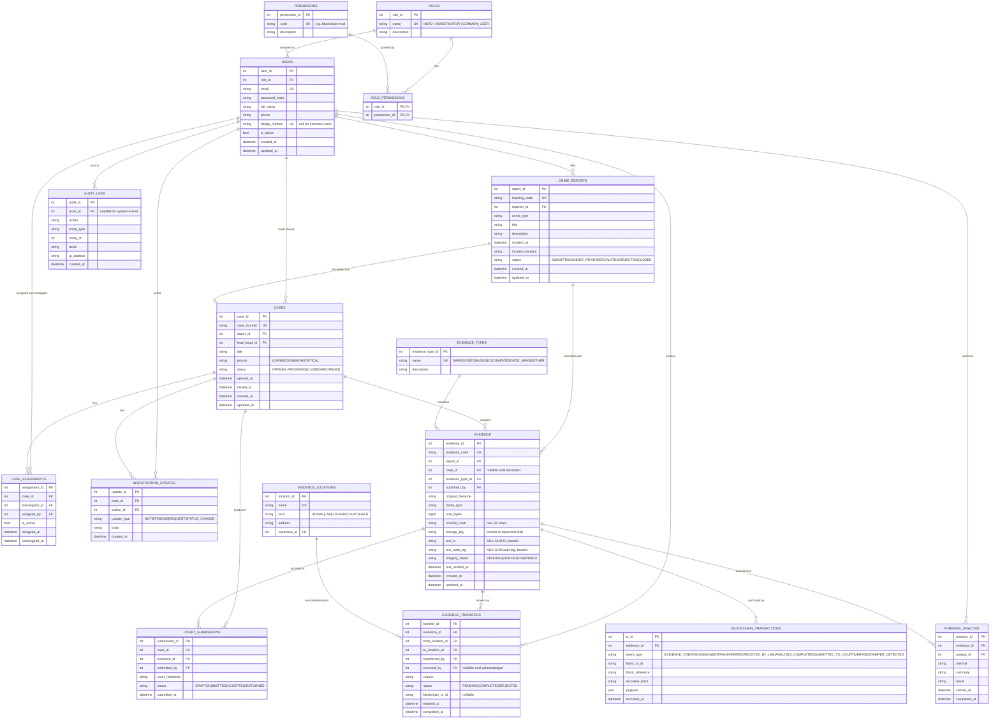

# BlockProof — ER Diagram

Entities are derived first (per the professor's requirement that evaluated tables come from the ER model).
14 entities, 3NF or higher. Mermaid source below renders on GitHub.

## Cardinality notes

- `USERS.role_id` → every user has exactly one role; a role has many users.
- `CRIME_REPORTS` 1—0..1 `CASES`: a report may be escalated into at most one case; a case originates from exactly one report.
- `CASES` 1—* `CASE_ASSIGNMENTS`: reassignment keeps history; only one row per case has `is_active = true`.
- `EVIDENCE.case_id` is nullable — evidence exists from the moment of the report, before a case is opened.
- `BLOCKCHAIN_TRANSACTIONS` is an append-only mirror of ledger events; PostgreSQL never mutates existing rows.
- `AUDIT_LOGS` is written by triggers, not by application code, for tamper-relevant actions.

## Normalization

- All non-key attributes depend on the whole PK and only the PK (2NF/3NF).
- Repeating groups (permissions per role, assignments per case, transfers per evidence) are separate tables.
- Lookup values that are shared and describable (`EVIDENCE_TYPES`, `EVIDENCE_LOCATIONS`, `ROLES`, `PERMISSIONS`) are their own entities rather than free-text columns.
- Enumerations that are purely status labels with no extra attributes are kept as `CHECK`-constrained columns (documented in the data dictionary) rather than lookup tables, to keep joins readable — a deliberate 3NF-compatible choice.
